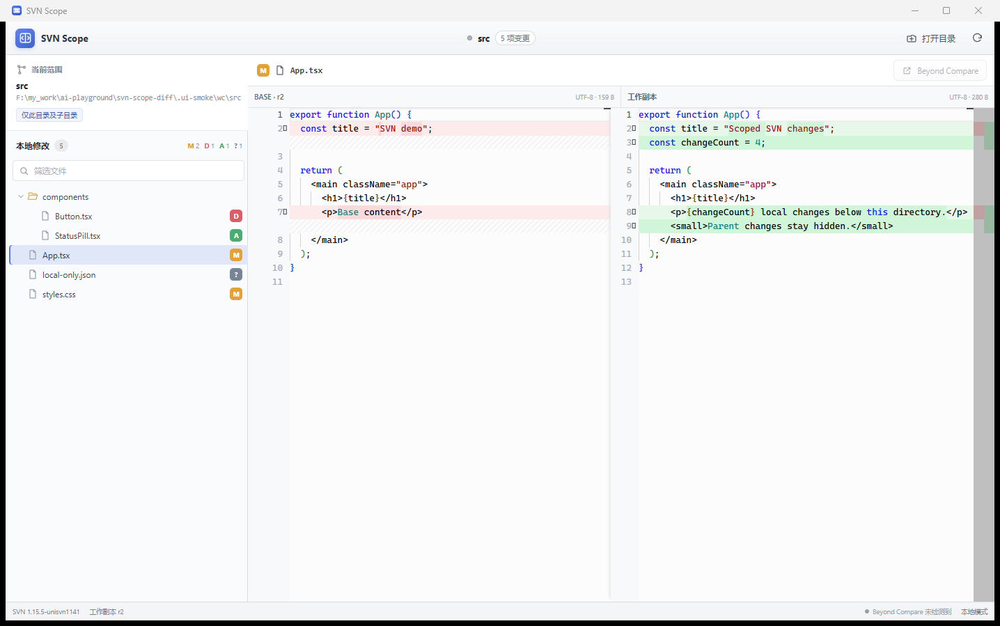

# SVN Scope

一个面向 Windows 的 Tauri 2 小工具：从资源管理器右键打开 SVN 工作副本内的任意目录，只展示这个目录及其子目录的本地修改，不包含父目录，也没有 Git 式 stage 暂存区。选择文件后，右侧直接显示 `BASE ↔ 工作副本` 的并排 diff。



## 已实现

- 支持选择一个或多个同工作副本内的小目录作为扫描范围；分别执行 `svn status --xml --depth infinity <目录>` 后合并结果，不会为了展示公共层级而扫描父目录。扫描范围可以随时添加或移除。
- SVN 只返回一个未版本化目录时，会在本地展开其内部文件和子目录，因此整棵新增目录不再只显示一个空的 `U` 项；`.svn` 管理目录和独立嵌套工作副本不会被递归进入。
- 文件树展示 `M / A / D / R / C / ! / U / ~`，其中 `U` 表示未版本化；内部仍保留 SVN 原始状态码 `?`。
- 左侧可在“层级 / 列表”间切换；列表支持按相对路径、文件名、所在目录、修改状态、扩展名排序，并可切换升降序。筛选区可在“文本 / 后缀”间切换：文本支持文件名与相对路径空格分词，后缀使用多选下拉，选项按当前修改动态生成并显示数量，包含目录与无后缀类型；下拉内可一键“全选”或“清除选择”。
- 列表和层级模式都有独立的提交复选框；选择热区为 28×28，层级目录使用全选/半选/未选三态。待提交选择采用浅色描边与蓝色文件名，当前 Diff 文件则使用更强的左侧蓝条，二者不会混淆。选择状态跨显示模式、排序和筛选保留，并支持“全选当前筛选”“取消当前”和“清空”。
- 左侧修改区和右侧 Diff 之间有可拖动分隔条；宽度限制会为 Diff 保留可用空间，支持方向键微调、Shift 加速、Home/End 边界、双击复位，并在本机记住上次宽度。拖动过程直接更新网格宽度，避免让 Monaco 高频重渲染。
- 左侧“用 TortoiseSVN 提交”把勾选项作为具体路径转交给小乌龟 Commit 窗口；大量路径使用 UTF-16LE、无 BOM、LF 分隔的临时 `/pathfile`，完成后由 `/deletepathfile` 清理。未版本化目录不会直接转交，避免意外递归加入未知文件。
- 层级和列表中的每个 item 都提供统一右键菜单：局部刷新、单独提交、Revert、Blame、Show Log、复制相对/完整路径、系统默认打开、在资源管理器中定位，以及冲突项专用的冲突编辑器和“标记为已解决”。局部刷新只重查该文件，或该目录及子目录；不适用于当前状态的操作会明确禁用。Revert 与 Resolve 只打开 TortoiseSVN 的确认窗口，不会静默执行。
- 文本、属性和树冲突使用独立红色行标与类型标签；层级目录会汇总后代冲突数。右侧 Diff 同步显示冲突警示、工作副本冲突标签和检测到的文本冲突块，并可直接打开三方冲突编辑器。
- 顶部“刷新变更”（Ctrl+R）重新扫描全部当前范围；保留仍有效的当前 Diff 文件和提交选择，已恢复干净或消失的条目会从选择中移除。
- 默认开启工作副本文件事件监听；保存、创建、删除或重命名文件后，450ms 内的事件会先合并，再只对受影响路径执行 SVN 状态查询并补丁式更新左侧列表。当前正在查看的文件仍按原规则弹窗询问是否重载 Diff，不会被静默替换。
- 顶部“SVN Update”只更新当前扫描范围，不会连带父目录；多个范围会作为多个精确目标传给同一条命令。`svn.exe` 在独立可见控制台中直接输出进度。运行时按钮切换为“取消 Update”，先发送 Ctrl+Break 让 SVN 正常收尾，超时才强制终止；完成、失败或取消后自动重新扫描变更。Update 期间会暂时禁用提交、Revert、历史查询、批量 Diff、切换目录和手动刷新，避免并发操作工作副本。
- 完全本地的 Monaco 并排 diff；编辑器资源随 EXE 打包，不依赖 CDN。
- diff 顶部右侧可直接在“差异 / 全部”间切换：“差异”折叠长段未修改内容，“全部”显示完整文件。
- Diff 配色可在“按状态区分 / 蓝橙高对比 / 经典红绿”间切换并自动记忆。默认按状态区分时，新增与未版本化文件使用蓝紫色整文件高亮，普通修改仍使用红/绿双向对照。
- Diff 工具栏显示差异块总数，并可循环跳转到上一个/下一个差异；BASE 与工作副本各有独立的常驻搜索栏、命中数及上/下一个结果导航，两个搜索框可以同时保持打开。在“差异”模式中命中折叠行会自动展开并定位；窄窗口仍保持双栏。
- 左侧变更区和右侧 diff 各自独立滚动；右侧启用 Monaco Diff Overview Ruler，以当前配色标记整份文件中的删除与新增，当前视口可点击或拖动定位；普通滚动条保持独立细尺寸。
- 扫描合并 SVN 元数据查询并缓存工具探测；文本 diff 复用扫描得到的文件类型与 BASE revision，属性差异仅在展开时读取。
- 普通浏览时最近 12 个文本 diff 使用内存 LRU 缓存；切回文件时只校验大小与纳秒级修改时间，未更新就不再读取工作文件或调用 `svn cat`。
- 左侧“更新全部文本 Diff”按显式后缀白名单预热所有代码文本 diff，三路限并发并显示进度；批量期间缓存临时扩容，切换工作目录后恢复默认。当前包含 `.py / .cs / .bat / .cmd / .ps1 / .js / .ts / .tsx / .java / .cpp / .rs / .go / .sql / .json / .yaml` 等常见后缀，不包含 `.txt`、图片和未知后缀。
- 当前打开文件每 1.5 秒仅检查轻量元数据；发现磁盘更新后先询问是否重新加载，读取期间再次变化的内容不会写入缓存。
- UTF-8、UTF-8 BOM、UTF-16、GBK 文本解码；二进制和超大文件有明确提示。
- Beyond Compare 4/5 可选集成：自动发现常见安装位置，用 SVN `BASE` 快照和工作文件启动外部比较，左侧只读。
- 当前用户级资源管理器右键菜单：既支持右键文件夹，也支持文件夹背景；无需管理员。
- 不生成 MSI/NSIS。构建脚本输出一个便携目录和 ZIP。

## Beyond Compare 的复用结论

Beyond Compare 提供的是独立桌面应用和命令行入口，并没有适合嵌入 Tauri WebView 的官方比较控件或 SDK。因此本项目采用两层方案：

1. 默认使用本地打包的 Monaco，在应用内完成 Fork 风格的并排 diff。
2. 检测到 Beyond Compare 后显示按钮，按其官方命令行格式启动两个文件：左侧是 `svn cat -r BASE` 生成的临时快照，右侧是工作文件，并传入 `/leftreadonly` 与标题参数。

这样不需要复制、破解或重新分发 Beyond Compare，也不会把它变成本工具的硬依赖。Beyond Compare 的许可证由使用者自行负责。
工具位置按应用进程缓存；如果在 SVN Scope 运行期间安装 Beyond Compare 或修改其路径环境变量，请重启 SVN Scope。

## TortoiseSVN 集成

安装 TortoiseSVN 后，SVN Scope 会从注册表、标准安装目录、便携目录和 PATH 查找 `TortoiseProc.exe`。也可以显式指定：

```powershell
$env:SVN_SCOPE_TORTOISEPROC_EXE = 'D:\Tools\TortoiseSVN\bin\TortoiseProc.exe'
```

提交按钮只负责打开小乌龟的标准 Commit 窗口，不会绕过确认或直接提交。TortoiseSVN 默认开启“Select items automatically”，因此传入的文件会预先勾选；如果用户关闭该设置，SVN Scope 会显示提示但不会擅自修改注册表。真实目录变更可能让 TortoiseSVN 展开目录，界面会提醒在提交窗口中复核；未版本化目录则明确禁止直接转交。

item 右键菜单通过 TortoiseSVN 官方 `TortoiseProc.exe /command:* /path:*` 接口打开 `revert / blame / log / conflicteditor / resolve` 窗口。所有目标在 Rust 侧再次校验，必须同时位于当前扫描范围和 SVN 工作副本之内。`resolve` 不传 `/noquestion`，因此仍由 TortoiseSVN 做最后确认。

## 本地开发

### 前置条件

- Windows 10/11 x64
- Node.js 20+ 与 npm
- Rust stable MSVC 工具链
- Visual Studio 2022 C++ Build Tools（勾选“使用 C++ 的桌面开发”）
- Microsoft Edge WebView2 Runtime（Windows 10/11 通常已安装）
- SVN 命令行客户端 1.9+；TortoiseSVN 安装时可勾选 command line client tools
- TortoiseSVN 1.14+（可选，提交、历史、Revert 与冲突处理功能需要）

如果 `svn.exe` 不在 PATH，本工具也会检查 TortoiseSVN、SlikSVN 的常见路径。还可以设置：

```powershell
$env:SVN_SCOPE_SVN_EXE = 'D:\Tools\Subversion\bin\svn.exe'
```

可选指定 Beyond Compare：

```powershell
$env:SVN_SCOPE_BCOMPARE_EXE = 'D:\Tools\Beyond Compare 5\BCompare.exe'
```

### 调试运行

```powershell
cd .\svn-scope-diff
npm ci
npm run desktop:dev
```

也可以把待查看目录直接作为参数传给调试程序：

```powershell
npm run tauri -- dev -- -- 'D:\work\my-svn-project\src'
```

## 构建便携版（无安装器）

在项目目录运行一条命令：

```powershell
npm run portable
```

脚本执行 Tauri release `--no-bundle` 构建，然后生成：

```text
dist-portable\
├─ SVN Scope 0.2.0\
│  ├─ SVN Scope.exe
│  ├─ Register-ContextMenu.cmd
│  ├─ Unregister-ContextMenu.cmd
│  ├─ 对应 PowerShell 脚本
│  ├─ README-便携版.txt
│  └─ SHA256SUMS.txt
└─ SVN-Scope-0.2.0-win-x64.zip
```

首次构建会下载 npm/crates.io 依赖；之后是纯本机构建。产物不包含安装器、自动更新器、遥测或云服务。

## 使用便携版

1. 解压 ZIP 到一个固定目录。
2. 双击 `Register-ContextMenu.cmd`。它只写入 `HKCU\Software\Classes`，不需要管理员权限。
3. 在 SVN 项目中右键任意文件夹，或进入该文件夹后右键空白处，选择“用 SVN Scope 查看本地修改”。
4. Windows 11 的经典注册表菜单通常在“显示更多选项”中。
5. 移动便携目录后重新运行注册脚本；删除前先运行 `Unregister-ContextMenu.cmd`。

直接双击 `SVN Scope.exe` 也可以通过目录选择器使用。

## 范围与本地性

- 扫描命令没有 `-u/--show-updates`，因此不会访问 SVN 服务器。
- BASE 内容由本地 working copy pristine storage 读取；查看 diff 不需要网络。
- 传入一个或多个子目录时，每条状态命令的 target 都是对应子目录，结果还会再次按路径边界过滤，因此公共父目录中的其他修改不会出现。
- 被 SVN ignore 的内容保持隐藏，避免把 `node_modules` 等目录误当作修改。

## 限制

- 右键菜单使用无需安装/打包身份的经典 Shell 注册方式；Windows 11 通常把它放在“显示更多选项”。要进入新版一级菜单需要实现并注册 `IExplorerCommand`/稀疏包，这与纯便携目标冲突。
- 未版本化目录会做本地递归展开；如果其中包含非常大的未知目录树，首次展开的成本与本地文件数量相关。SVN 已在扫描范围根部判定为 ignored 的目录仍不会进入列表。
- 未版本化目录不会被直接转交给 TortoiseSVN；请先在工作副本中明确执行 SVN Add，或选择具体的未版本化文件。真实目录变更在提交窗口中可能展开子项，需要最终复核。
- 未签名的 EXE 若从互联网下载，Windows SmartScreen 可能提示未知发布者；本地构建不影响运行。
- 便携 EXE 使用系统 WebView2 Runtime，不携带体积很大的 Fixed Version Runtime。

## 参考

- [Tauri 2 prerequisites](https://v2.tauri.app/start/prerequisites/)
- [Tauri build / `--no-bundle`](https://v2.tauri.app/distribute/)
- [Subversion `svn cat`](https://svnbook.red-bean.com/en/1.8/svn.ref.svn.c.cat.html)
- [Beyond Compare command-line reference](https://www.scootersoftware.com/v5help/command_line_reference.html)
